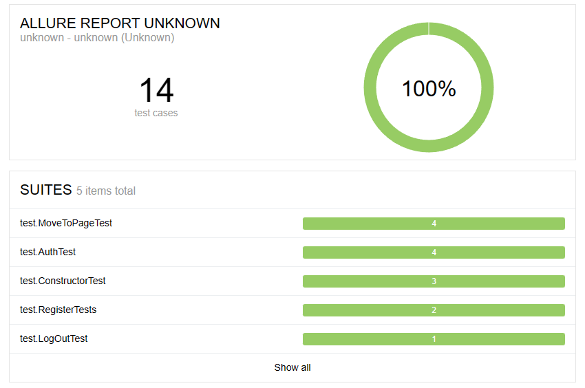

# Дипломный проект по автоматизации тестирования для Stellarburgers. 
<a target="_blank" href="https://stellarburgers.nomoreparties.site/">Веб сайт Stellarburgers</a>


## :memo: Содержание:

- [Реализованные проверки](#boom-Реализованные-проверки)
- [Технологии](#classical_building-Технологии)
- [Запуск из терминала](#electron-Запуск-тестов-из-терминала)
- [Allure отчет](#bar_chart-Allure-отчет)


## :boom: Реализованные проверки

#### Регистрация
- ✓ Успешная регистрация
- ✓ Ошибку для некорректного пароля
#### Вход 
- ✓ вход по кнопке «Войти в аккаунт» на главной,
- ✓ вход через кнопку «Личный кабинет»,
- ✓ вход через кнопку в форме регистрации,
- ✓ вход через кнопку в форме восстановления пароля.
#### Переходы по страницам 
- ✓ Переход по клику на «Личный кабинет».
- ✓ Переход из личного кабинета в конструктор 
- ✓ Переход по клику на «Конструктор» и на логотип Stellar Burgers.
- ✓ Переходы к разделам: «Булки», «Соусы», «Начинки».
#### Выход из аккаунта
- ✓ Проверь выход по кнопке «Выйти» в личном кабинете.

## :classical_building: Технологии
<p align="center">


</p>


## :electron: Запуск тестов из терминала

```
mvn clean test
```

## :bar_chart: Allure-отчет

